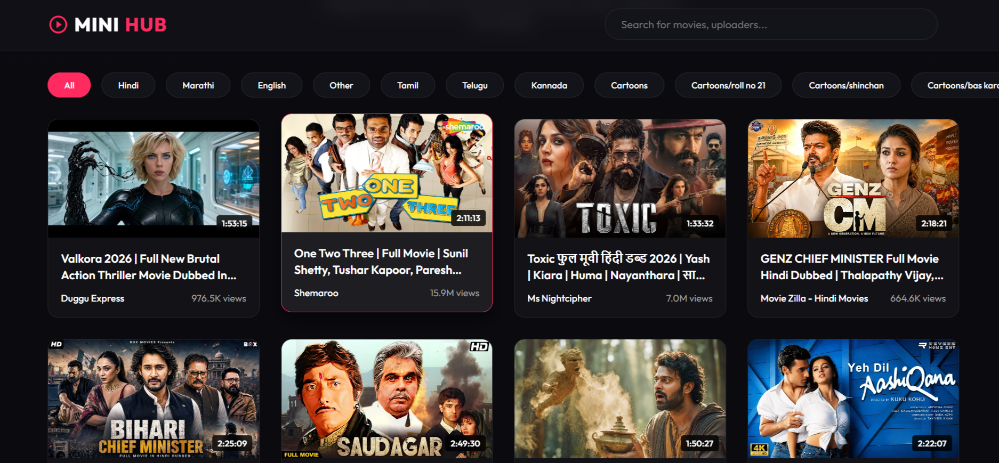

# MINI YT HUB

MINI YT HUB is a premium, beautifully designed movie and video scrapper platform. It automatically scrapes various categories (like Anime, Cartoons, Bengali, Hindi, Hollywood, etc.) from official YouTube channels and presents them in a modern, dark-themed user interface.

🔗 **Live Demo**: [https://sayanpal514-hue.github.io/MINI-YT-HUB/](https://sayanpal514-hue.github.io/MINI-YT-HUB/)

## 📸 Interface Preview



## ✨ Features

* **Premium UI**: Stunning dark mode with glassmorphism effects.
* **Auto-Scraping**: `yt-dlp` powered Python script to scrape videos by categories and channels.
* **Rich Filtering**: Filter dynamically by multiple categories (Cartoons, Anime, Hollywood, Bengali, etc.).
* **Smart Search**: Search instantly by video title, uploader, or category.
* **Dedicated Player**: Integrated video player page with side recommendations.

## 🚀 How to Run

1. **Scrape Data (Optional - Data is included)**:
   ```bash
   cd scrapper
   pip install -r requirements.txt
   python main.py
   ```

2. **Run the Website**:
   Due to CORS policies, you need to run a local web server to fetch the JSON data.
   ```bash
   # From the root directory (where index.html is located)
   python -m http.server 8000
   ```
   Then open `http://localhost:8000/index.html` in your browser.

## 🛠️ Built With

* **Frontend**: HTML5, CSS3 (Vanilla), JavaScript
* **Backend Scraper**: Python, `yt-dlp`

## ⚠️ Disclaimer

This project is created **strictly for educational purposes only**. It is intended to demonstrate web scraping techniques, front-end development, and video data presentation. All video content displayed is sourced from and linked back to official YouTube channels — no video files are hosted, downloaded, or redistributed by this project.

The developer(s) of MINI YT HUB do not own, claim ownership of, or take responsibility for any third-party content displayed through this application. All trademarks, video content, and channel names belong to their respective owners. Users are responsible for ensuring their use of this software complies with YouTube's Terms of Service and applicable copyright laws in their jurisdiction.

This project is **not affiliated with, endorsed by, or sponsored by YouTube or Google LLC**.

## 📄 License

This project is licensed under the **MIT License**.

```
MIT License

Copyright (c) 2026 MINI YT HUB

Permission is hereby granted, free of charge, to any person obtaining a copy
of this software and associated documentation files (the "Software"), to deal
in the Software without restriction, including without limitation the rights
to use, copy, modify, merge, publish, distribute, sublicense, and/or sell
copies of the Software, and to permit persons to whom the Software is
furnished to do so, subject to the following conditions:

The above copyright notice and this permission notice shall be included in all
copies or substantial portions of the Software.

THE SOFTWARE IS PROVIDED "AS IS", WITHOUT WARRANTY OF ANY KIND, EXPRESS OR
IMPLIED, INCLUDING BUT NOT LIMITED TO THE WARRANTIES OF MERCHANTABILITY,
FITNESS FOR A PARTICULAR PURPOSE AND NONINFRINGEMENT. IN NO EVENT SHALL THE
AUTHORS OR COPYRIGHT HOLDERS BE LIABLE FOR ANY CLAIM, DAMAGES OR OTHER
LIABILITY, WHETHER IN AN ACTION OF CONTRACT, TORT OR OTHERWISE, ARISING FROM,
OUT OF OR IN CONNECTION WITH THE SOFTWARE OR THE USE OR OTHER DEALINGS IN THE
SOFTWARE.
```

See the [LICENSE](./LICENSE) file for full details.
